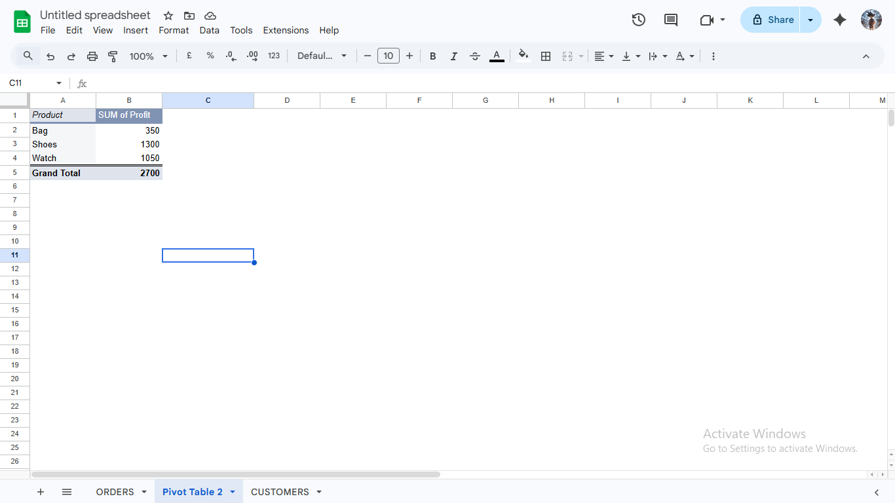
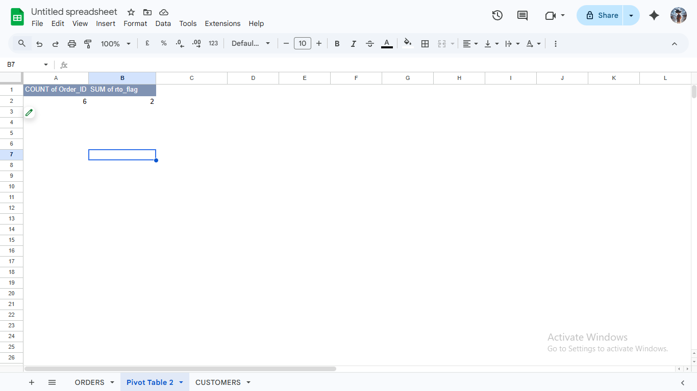
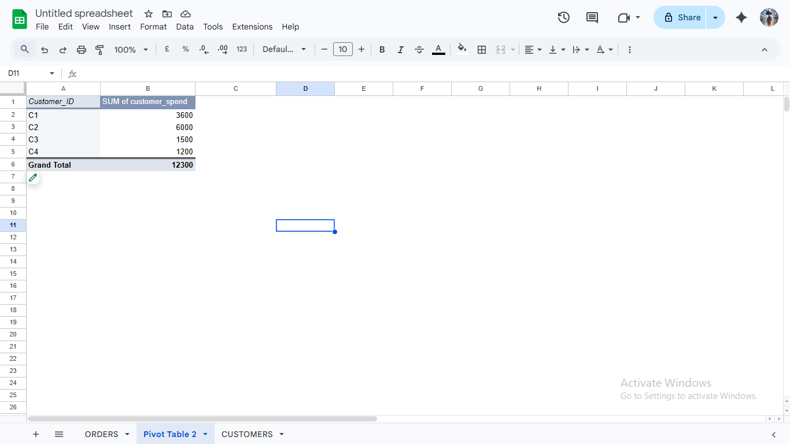

# 📊 E-commerce Data Analysis Project

## 🔹 Project Overview
This project analyzes real e-commerce (dropshipping) data to understand sales performance, customer behavior, and business insights.

---

## 🎯 Objectives
- Analyze sales and profit
- Identify top products and customers
- Calculate RTO (Return to Origin) percentage
- Understand state-wise performance
- Improve business decision making

---

## 🛠 Tools Used
- Google Sheets / Excel
- MySQL
- Python (Pandas)
- Power BI

---

## 📁 Dataset
- Raw Data: `data/raw_data.csv`
- Clean Data: `data/clean_data.csv`

---

## 🧹 Data Cleaning
- Removed duplicates
- Handled missing values
- Fixed date format
- Created new columns:
  - Profit
  - RTO_Flag

---

## 📊 Pivot Analysis

### 1. Ad Spend Analysis
- Check Ad Spend in each state to see which states give more or less profit.

### 2. Product Profit Analysis
- Identified top-selling and high-profit products

### 3. RTO Count Analysis
- Determine how many RTO (Return to Origin) orders happen out of total customers.

### 4. Top Customer Spend
- Identify which customer spent the most overall

  (File: [Excel_pivot_analysis](pivot_analysis.xlsx) 
  <\n img src="pivot1.png" width="200"/>   
   

---

## 💻 SQL Queries
- Top State Revenue
- Recent Daily Sales  
- Repeat Customers  
- Loss Orders 

(File: [SQL Queries](SQL_queries.sql)

---

## 🐍 Python (Pandas) Analysis
- Data aggregation using groupby
- Profit calculation
- Trend analysis

(File: `python/analysis.py`)

---

## 📊 Dashboard
Created interactive dashboard in Power BI including:
- Total Sales
- Total Profit
- RTO %
- Top Products
- State-wise analysis

(File: `powerbi/dashboard.pbix`)

---

## 📸 Screenshots
(Add your screenshots in `/screenshots` folder)

---

## 🔍 Key Insights
- Top State: __________
- Top Product: __________
- RTO %: __________
- Most Valuable Customer: __________

---

## 🚀 Conclusion
This project helped in understanding real-world data analysis and improving business decision-making using data.

---

## 👤 Author
- Name: __________
- Role: Data Analyst (Beginner)
